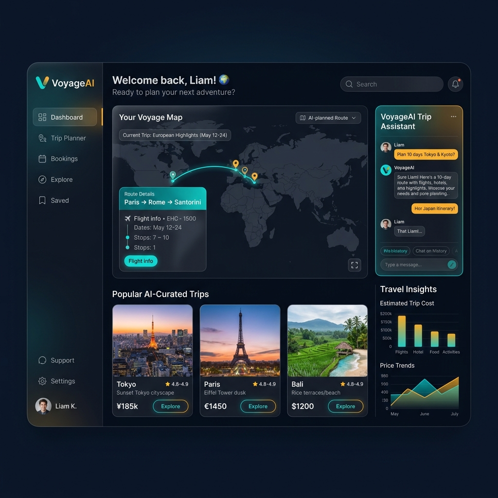

# 🚀 VoyageAI - AI-Powered Travel Booking & Planning Platform

VoyageAI is a premium, fully-responsive travel booking and personalized trip planning application. Leveraging the power of **Google Gemini AI**, it acts as a personal travel agent to generate tailor-made day-by-day itineraries based on user style, duration, and budget. Integrates secure **Stripe Checkout** for booking packages, **Firebase** for OAuth authentication, and **Cloudinary** for image uploads.

🔗 **Live URL:** [https://frontend-eight-opal-87.vercel.app](https://frontend-eight-opal-87.vercel.app)

---

## 📸 Platform Preview



---

## ⚡ Key Features

### 🤖 1. AI Trip Planner (Gemini SDK)
* Generates structured, day-by-day itineraries (including timing, location highlights, and cost estimates).
* Customizable parameters such as destination, budget cap, travel styles (Adventure, Beach, City Tour, Romantic, Wildlife, etc.), and duration.
* Displays formatting using markdown renderers for easy readability.

### 💳 2. Secure Stripe Payments
* Seamless shopping-to-checkout flow for travel packages.
* Secure payment gateway processing through Stripe sessions.
* Instant order creation and update handled dynamically by Webhooks.

### 🔐 3. Authentication (Multi-Provider)
* Secure login and registration with email verification.
* Built-in **Google OAuth** login powered by Firebase client SDK.
* Persisted user sessions via JWT (JSON Web Tokens) with auto-redirects.

### 👥 4. Role-Based Dashboards
* **Admin Dashboard:**
  * **Analytics Panel:** Displays platform-wide metrics (total revenue, total users, bookings, packages count) in modern, clean visual cards.
  * **Destinations Manager:** Full CRUD interface to add/edit/delete destinations, upload high-res images, and flag trending locations.
  * **Packages Manager:** Management dashboard for setting durations, inclusions, pricing, and available tour dates.
  * **Bookings Manager:** View and update transaction statuses (Pending, Completed, Cancelled).
  * **User Manager:** Monitor registered users, update permissions, and assign roles.
* **User Dashboard:**
  * **My Bookings:** List of active and past trips with receipt downloads.
  * **My Wishlist:** Quick-save cards of destinations and packages.
  * **My Reviews:** Submit package reviews, ratings, and experience testimonials.
  * **Notification Panel:** Real-time updates on bookings and special promotional offers.

### 🔍 5. Interactive Destination & Package Explorer
* Search bar query matching destinations.
* Filtering system sorting by price range, star rating, duration, and categories.
* Beautiful touch-enabled sliders and carousels using Swiper.js.
* Clean video hero section.

---

## 🛠️ Technology Stack

| Layer | Technology |
| :--- | :--- |
| **Frontend Framework** | Next.js 16 (App Router) & React 19 |
| **Styling** | Tailwind CSS 4 & PostCSS |
| **Animations** | Framer Motion (for responsive UI/UX & micro-animations) |
| **Authentication SDK** | Firebase Web SDK (Google OAuth / Password sign-in) |
| **Media Slider** | Swiper.js |
| **Icons Library** | Lucide React |
| **Backend API** | Node.js, Express.js (v5) & TypeScript |
| **Database & ORM** | MongoDB & Mongoose |
| **AI Integration** | Google Generative AI (Gemini Pro SDK) |
| **Payments Integration**| Stripe Webhook & Stripe Checkout SDK |
| **Image Hosting** | Cloudinary API & Multer Storage |

---

## 📂 Project Architecture (Monorepo)
For local development, the repository is split into two directories:
* `/frontend` - Next.js 16 Client Portal (React 19 & Tailwind CSS 4)
* `/backend` - Express.js API Gateway (TypeScript, MongoDB, Gemini AI & Stripe)

---

## 🚀 Local Installation & Set Up

### 📋 Prerequisites
Make sure you have **Node.js** (v18.x or above) installed. You will also need active API keys for **Google Gemini**, **Stripe**, **Cloudinary**, and **Firebase**.

### ⚙️ Step 1: Clone the Project
```bash
git clone https://github.com/Juma-islam/travel-booking-frontend.git
cd travel-booking-frontend
```

### ⚙️ Step 2: Install Backend (Express Server)
If you have the backend API codebase locally:
```bash
cd backend
npm install
```
Configure your `.env` variables:
```env
PORT=5000
MONGO_URI=your_mongodb_atlas_uri
JWT_SECRET=your_jwt_secret_min_32_characters
NODE_ENV=development
FRONTEND_URL=http://localhost:3000

# Stripe & Gemini & Cloudinary Keys
STRIPE_SECRET_KEY=sk_test_...
STRIPE_WEBHOOK_SECRET=whsec_...
GEMINI_API_KEY=your_gemini_api_key
CLOUDINARY_CLOUD_NAME=your_cloud_name
CLOUDINARY_API_KEY=your_api_key
CLOUDINARY_API_SECRET=your_api_secret
```
Run Backend server:
```bash
npm run dev
```

### ⚙️ Step 3: Install Frontend (Next.js Application)
```bash
cd ../frontend
npm install
```
Configure your `.env.local` variables:
```env
NEXT_PUBLIC_API_URL=http://localhost:5000

# Firebase SDK client credentials (Optional for Google login)
NEXT_PUBLIC_FIREBASE_API_KEY=your_api_key
NEXT_PUBLIC_FIREBASE_AUTH_DOMAIN=your_auth_domain
NEXT_PUBLIC_FIREBASE_PROJECT_ID=your_project_id
NEXT_PUBLIC_FIREBASE_STORAGE_BUCKET=your_storage_bucket
NEXT_PUBLIC_FIREBASE_MESSAGING_SENDER_ID=your_sender_id
NEXT_PUBLIC_FIREBASE_APP_ID=your_app_id
```
Start Next.js local server:
```bash
npm run dev
```
Open [http://localhost:3000](http://localhost:3000) in your web browser.

---

## 🔐 Pre-Seeded Demo Accounts (Testing)

Test the application instantly using these pre-registered accounts:

| Role | Email | Password |
| :--- | :--- | :--- |
| **Admin** | `admin@travelai.com` | `Admin123!` |
| **User** | `demo@travelai.com` | `demo123` |

---

## 📡 API Endpoint Summary

The frontend connects to the following key Express.js backend endpoints:

| Endpoint | Method | Purpose | Authentication |
| :--- | :--- | :--- | :--- |
| `/api/auth/login` | `POST` | Exchange credentials for a JWT token | Public |
| `/api/auth/register`| `POST` | Setup new user database profiles | Public |
| `/api/ai/plan-trip` | `POST` | Request AI itineraries from Gemini Pro | JWT User Token |
| `/api/packages` | `GET` | Fetch active travel packages & prices | Public |
| `/api/destinations`| `GET` | Fetch trending locations & filters | Public |
| `/api/bookings` | `POST` | Initiate Stripe Checkout sessions | JWT User Token |
| `/api/admin/stats` | `GET` | Retrieve total revenue, packages & users | JWT Admin Token |

---

## 📄 License
This project is licensed under the MIT License.
